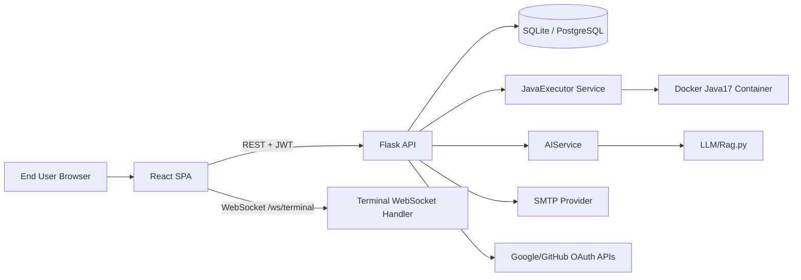
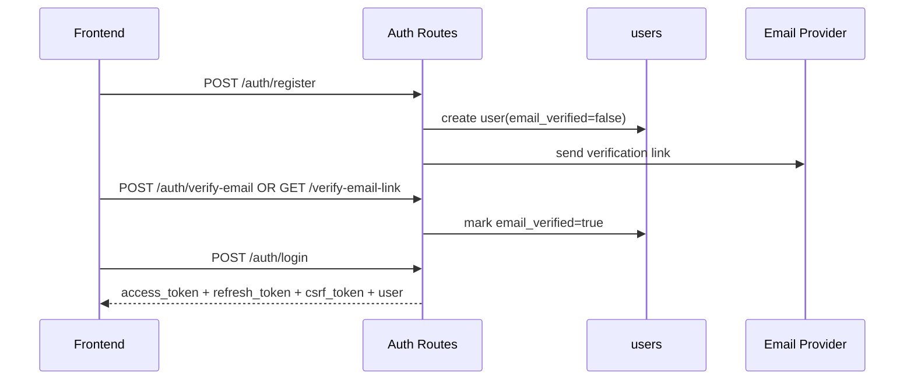
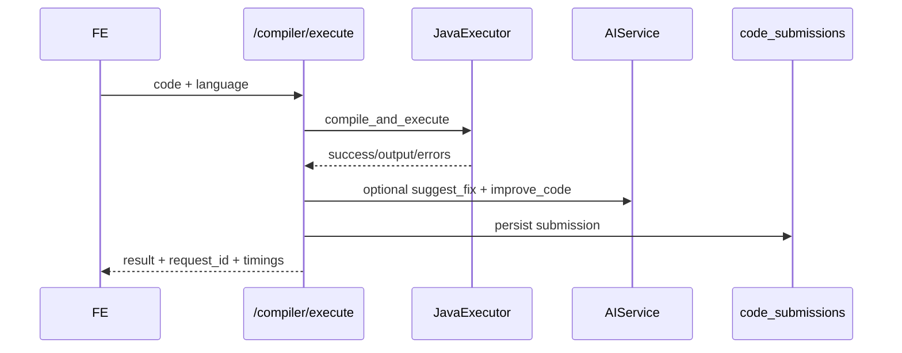
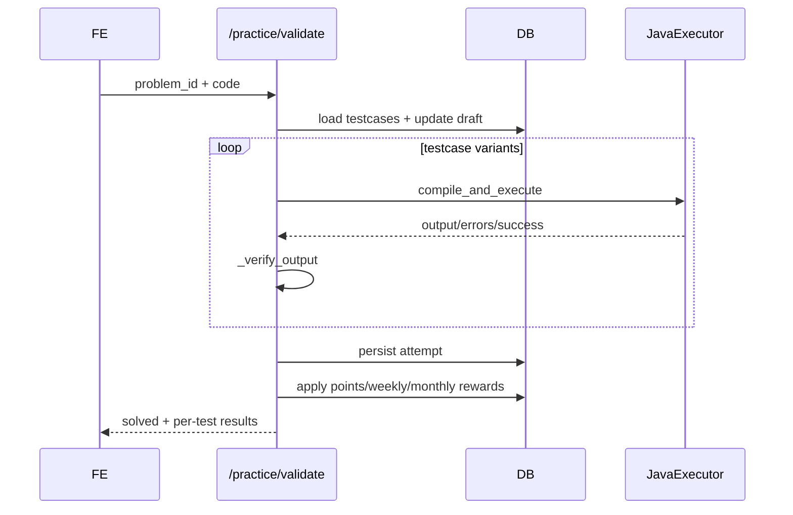

# CodeMaster Full Technical Documentation

## Document Control
- Project: `CodeMaster`
- Repository Root: `c:\Users\ASUS\OneDrive\Desktop\CodeMaster-master`
- Scope: End-to-end architecture and implementation details (backend, frontend, data, security, operations)
- Baseline: Current codebase snapshot in workspace

---

## 1. Project Overview
CodeMaster is an AI-enabled Java learning platform composed of:
- A Flask backend API for auth, compiler, assessment, practice, analytics, dashboard, content, settings, support, profile, and generator/explainer features
- A React + TypeScript frontend SPA
- Java execution sandbox (Docker-based by default, host JDK fallback)
- Local RAG/LLM integration for generation/explanation/error-fix suggestions
- Relational persistence through SQLAlchemy (SQLite default, PostgreSQL optional)

Primary goals:
- Learn Java via curated content and practice
- Write/execute Java safely
- Get AI-assisted generation and explanations
- Track progress, points, achievements, streaks

---

## 2. High-Level Architecture



Architectural style:
- Monorepo split into `backend`, `frontend`, and `LLM`
- Backend uses Controller/Route + Service + ORM pattern
- Frontend uses page-driven SPA with centralized API client wrapper

---

## 3. Repository Structure

## 3.1 Top Level
- `backend/`: Flask API, models, services, migrations, seed scripts
- `frontend/`: React SPA
- `LLM/`: local RAG model orchestration
- `docker-compose.yml`: PostgreSQL service

## 3.2 Backend Layout
- `backend/app/__init__.py`: app factory and blueprint registration
- `backend/app/config.py`: environment-driven config
- `backend/app/middleware/auth.py`: JWT auth decorators
- `backend/app/models/*.py`: SQLAlchemy schema
- `backend/app/routes/*.py`: all API controllers
- `backend/app/services/*.py`: execution, AI, assessment, points, terminal
- `backend/migrations/`: Alembic migration scripts
- `backend/seed_content.py`, `seed_questions.py`, `seed_practice.py`: content/data seeding
- `backend/run.py`: local server entrypoint

## 3.3 Frontend Layout
- `frontend/src/App.tsx`: route map
- `frontend/src/lib/api.ts`: typed API client and auth refresh
- `frontend/src/pages/*`: feature pages
- `frontend/src/components/layout/*`: application shell
- `frontend/src/components/ui/*`: shared UI primitives

---

## 4. Backend Architecture

## 4.1 App Factory and Extension Wiring
File: `backend/app/__init__.py`

Registered Flask extensions:
- `SQLAlchemy` (`db`)
- `Flask-Migrate` (`migrate`)
- `Flask-JWT-Extended` (`jwt`)
- `Flask-CORS` (`cors`)
- `Flask-Sock` (`sock`)

Initialization flow:
1. Resolve config (`FLASK_ENV`, fallback `development`)
2. Configure rotating logs (`backend/logs/backend.log`)
3. Initialize Flask extensions
4. Register blueprints under `/api/*`
5. Register websocket routes from `app.routes.terminal_ws`
6. Add global handlers:
   - `404 -> {"error":"Not found"}`
   - `500 -> rollback + {"error":"Internal server error"}`
7. Health endpoint: `GET /api/health`

Blueprint prefixes:
- `/api/auth`
- `/api/generator`
- `/api/explainer`
- `/api/compiler`
- `/api/assessment`
- `/api/analytics`
- `/api/dashboard`
- `/api/profile`
- `/api/practice`
- `/api/content`
- `/api/settings`
- `/api/support`

---

## 4.2 Middleware and Security Chain

### `token_required` (`backend/app/middleware/auth.py`)
Behavior:
1. `verify_jwt_in_request()`
2. Resolve identity, fetch user row
3. Reject if user missing/deleted
4. Validate password freshness claim (`pwd`) vs `password_updated_at`
5. Inject `current_user` into route kwargs

Failure response:
- `401 {"error":"Invalid or expired token","message":...}`

---

## 4.3 Route Inventory (Exhaustive)

## 4.3.1 Auth Routes (`/api/auth`)
File: `backend/app/routes/auth.py`

- `POST /register`
- `POST /login`
- `POST /refresh` (`@jwt_required(refresh=True)`)
- `POST /verify-email`
- `GET /verify-email-link`
- `POST /resend-verification`
- `POST /forgot-password/request-otp`
- `POST /forgot-password/reset`
- `GET /me` (`@token_required`)
- `POST /logout` (`@jwt_required`)
- `GET /csrf` (`@token_required`)
- `GET /google/url`
- `POST /google/callback`
- `GET /github/url`
- `POST /github/callback`

Implementation highlights:
- Email verification token hashing via SHA-256
- OTP hashing via SHA-256
- SMTP integration for verification and reset OTP
- Access + refresh JWT issuance
- OAuth account create/link + daily streak update on login

## 4.3.2 Compiler Routes (`/api/compiler`)
File: `backend/app/routes/compiler.py`

- `POST /execute` (`@token_required`)
- `POST /check` (`@token_required`)
- `POST /terminal/start` (`@token_required`)
- `POST /terminal/stop` (`@token_required`)
- `POST /suggest-fix` (`@token_required`)
- `POST /improve-code` (`@token_required`)
- `POST /analyze` (`@token_required`)
- `GET /submissions` (`@token_required`)

Implementation highlights:
- Request correlation via `X-Request-Id`
- Max code length enforcement (`Config.MAX_CODE_LENGTH`)
- AI fix and improvement integration
- Submission persistence to `code_submissions`
- Optional webhook alerting for execution failures

## 4.3.3 Generator Routes (`/api/generator`)
File: `backend/app/routes/generator.py`

- `POST /generate` (`@token_required`)
- `POST /chat` (`@token_required`)
- `POST /history` (`@token_required`) create chat
- `GET /history` (`@token_required`)
- `GET /history/<chat_id>` (`@token_required`)
- `PATCH|PUT /history/<chat_id>` (`@token_required`) rename
- `DELETE /history/<chat_id>` (`@token_required`)

Implementation highlights:
- Per-user chat ownership checks
- Prompt language gating (Java-only)
- Skill point consumption per generation request
- Chat message persistence (`generator_chat_messages`)

## 4.3.4 Explainer Routes (`/api/explainer`)
File: `backend/app/routes/explainer.py`

- `POST /explain` (`@token_required`)
- `GET /history` (`@token_required`, currently placeholder)

Implementation highlights:
- Strict compile-only validation before explanation
- Returns friendly guidance when code has compilation errors

## 4.3.5 Assessment Routes (`/api/assessment`)
File: `backend/app/routes/assessment.py`

- `GET /questions` (`@token_required`)
- `POST /start` (`@token_required`)
- `POST /submit` (`@token_required`)
- `GET /results/<assessment_id>` (`@token_required`)
- `POST /coding/run-testcases` (`@token_required`)
- `POST /accept-level-up` (`@token_required`)

## 4.3.6 Practice Routes (`/api/practice`)
File: `backend/app/routes/practice.py`

- `GET /problems` (`@token_required`)
- `GET /catalog` (`@token_required`)
- `GET /problems/<problem_id>` (`@token_required`)
- `POST /attempts` (`@token_required`)
- `PATCH /attempts/<attempt_id>` (`@token_required`)
- `GET /attempts` (`@token_required`)
- `GET /drafts` (`@token_required`)
- `PUT /drafts` (`@token_required`)
- `POST /validate` (`@token_required`)

Implementation highlights:
- Input variant builder for testcase robustness
- Rich verifier engine `_verify_output(...)` with problem-specific logic
- Runtime-error-after-output handling path in validation
- Points and periodic goal bonus awarding on successful solve

## 4.3.7 Profile Routes (`/api/profile`)
File: `backend/app/routes/profile.py`

- `GET /` (`@token_required`)
- `PATCH /` (`@token_required`)
- `POST /password` (`@token_required`, CSRF enforced)
- `DELETE /` (`@token_required`, CSRF enforced)
- `POST /avatar` (`@token_required`)
- `DELETE /avatar` (`@token_required`)
- `GET /submissions` (`@token_required`)

Implementation highlights:
- Password/account deletion rate limiting
- CSRF token verification for sensitive actions
- Soft-delete/anonymization strategy for account deletion

## 4.3.8 Dashboard Routes (`/api/dashboard`)
File: `backend/app/routes/dashboard.py`

- `GET /stats` (`@token_required`)
- `GET /recent` (`@token_required`)

## 4.3.9 Analytics Routes (`/api/analytics`)
File: `backend/app/routes/analytics.py`

- `GET /overview` (`@token_required`)
- `GET /progress` (`@token_required`)
- `GET /activity` (`@token_required`)
- `GET /trends` (`@token_required`)
- `POST /time-spent` (`@token_required`)

## 4.3.10 Content Routes (`/api/content`)
File: `backend/app/routes/content.py`

- `GET /featured-courses` (`@token_required`)
- `GET /learning-paths` (`@token_required`)
- `GET /theory-pages` (`@token_required`)
- `POST /videos/complete` (`@token_required`)
- `POST /courses/open` (`@token_required`)

## 4.3.11 Settings Routes (`/api/settings`)
File: `backend/app/routes/settings.py`

- `GET /` (`@token_required`)
- `PATCH /` (`@token_required`)

## 4.3.12 Support Routes (`/api/support`)
File: `backend/app/routes/support.py`

- `POST /contact` (public)

## 4.3.13 WebSocket Routes
File: `backend/app/routes/terminal_ws.py`

- `WS /ws/terminal?sessionId=<id>[&token=<jwt>]`

---

## 5. Service Layer (Methods and Interactions)

## 5.1 `AIService` (`backend/app/services/ai_service.py`)
Core methods:
- `generate_code(prompt, context=None)`
- `explain_code(java_code)`
- `suggest_error_fix(error_message, code_context, error_type, error_line, error_column)`
- `improve_code(java_code, focus_areas=None)`

Dependencies:
- Local RAG loader (`LLM/Rag.py`)

Behavior:
- Code generation sanitizes model output and enforces Java-like result
- Strict retry path for non-Java first output
- Explanation formats line-by-line bullet structure

## 5.2 `JavaExecutor` (`backend/app/services/java_executor.py`)
Core methods:
- `compile_and_execute(java_code, input_data="")`
- `compile_only(java_code)`

Execution modes:
- Docker mode (default): isolated compile/run
- Subprocess mode: host `javac/java` fallback

Key internals:
- structured compiler parsing (`type/line/column/file`)
- runtime stack trace parsing
- timeout handling for compile and execute

## 5.3 `AssessmentService` (`backend/app/services/assessment_service.py`)
Core methods:
- `build_assessment_question_set(level)`
- `calculate_score(questions, answers)`
- `run_coding_test_cases(question, code)`

Key rules:
- question split (`mcq/msq/coding`) with weighted scoring
- coding correctness via testcase execution

## 5.4 `Skill Points Service` (`backend/app/services/skill_points_service.py`)
Key methods:
- `apply_daily_login_streak(user, now)`
- `award_practice_problem_points(user, problem_id, level)`
- `award_video_points(user, video_key, level)`
- `consume_generation_points(user, prompt)`
- `award_weekly_goal_completion(user, now)`
- `award_monthly_goal_completion(user, now)`

Consistency strategy:
- All point events persisted to `skill_point_transactions`
- Unique event keys prevent duplicate rewards

## 5.5 `TerminalSessionManager` (`backend/app/services/terminal_sessions.py`)
Responsibilities:
- Terminal session lifecycle
- Docker attach and stream bridging
- Session cleanup and limits (idle/runtime/output)
- Optional token-bound user ownership validation

## 5.6 `llm_proxy` (`backend/app/services/llm_proxy.py`)
- `use_external_llm_service()` (currently returns `False`)
- `call_llm_service(path, payload)` for optional external microservice mode

---

## 6. Data Model and Schema

## 6.1 Entity Catalog
From `backend/app/models/__init__.py`:
- `User`
- `CodeSubmission`
- `Assessment`, `Question`
- `AnalyticsEvent`
- `PracticeProblem`, `PracticeAttempt`, `PracticeDraft`
- `UserSettings`
- `FeaturedCourse`
- `LearningPathConcept`, `LearningPathSubtopic`
- `TheoryCoursePage`
- `GeneratorChat`, `GeneratorChatMessage`
- `SkillPointTransaction`

## 6.2 Detailed Table Design (Current ORM)

### `users`
- PK: `id`
- Unique/indexed: `email`, `username`, `google_id`, `github_id`
- Auth/security: `password_hash`, `email_verified`, verification token hash + expiry, reset OTP hash + expiry, `password_updated_at`, `csrf_token`
- Account lifecycle: `deletion_requested_at`, `deleted_at`
- Profile: `skill_level`, `total_points`, `profile_image_url`, `bio`, `streak_days`, `last_active_date`
- Relations: submissions, assessments, generator chats

### `code_submissions`
- PK: `id`; FK: `user_id`
- fields: `code`, `language`, `input_data`, `output`, `status`, `execution_time`, `compilation_time`, `created_at`

### `questions`
- PK: `id`
- fields: `question_text`, `question_type`, `options`, `correct_answer`, `explanation`, `difficulty`, `tags`, `created_at`

### `assessments`
- PK: `id`; FK: `user_id`
- fields: `level`, `score`, `total_questions`, `answers(JSON)`, `started_at`, `completed_at`

### `analytics_events`
- PK: `id`; FK: `user_id`
- fields: `event_type`, `event_data(JSON)`, `created_at`

### `practice_problems`
- PK: `id`
- fields: `title`, `description`, `level`, `difficulty`, `section`, `order_index`, `tags(JSON)`, `starter_code`, `constraints`, `expected_output`, `test_cases(JSON)`, `created_at`

### `practice_attempts`
- PK: `id`; FK: `user_id`, `problem_id`
- fields: `status`, `last_code`, `submitted_at`, `score`, `time_ms`

### `practice_drafts`
- PK: `id`; FK: `user_id`, `problem_id`
- fields: `code`, `updated_at`
- unique constraint: `(user_id, problem_id)`

### `user_settings`
- PK: `id`; FK unique `user_id`
- fields: `theme`, `editor_theme`, `font_size`, `tab_size`, `word_wrap`, `vim_mode`, `language`, `updated_at`

### `featured_courses`
- PK: `id`
- fields: `slug(unique)`, `title`, `description`, `language`, `kind`, `route_path`, `external_url`, `order_index`, `created_at`

### `learning_path_concepts`
- PK: `id`
- fields: `slug(unique)`, `title`, `description`, `level`, `tutorial_url`, `order_index`, `created_at`

### `learning_path_subtopics`
- PK: `id`; FK `concept_id`
- fields: `title`, `order_index`, `created_at`

### `theory_course_pages`
- PK: `id`
- fields: `slug(unique)`, `title`, `level`, `html_path`, `order_index`, `created_at`

### `generator_chats`
- PK: `id`; FK `user_id`
- fields: `title`, `created_at`, `updated_at`

### `generator_chat_messages`
- PK: `id`; FK `chat_id`
- fields: `role`, `content`, `code`, `created_at`

### `skill_point_transactions`
- PK: `id`; FK `user_id`
- fields: `event_type`, `event_key`, `points_delta`, `event_data(JSON)`, `created_at`
- unique constraint: `(user_id, event_type, event_key)`

---

## 7. Query and Business Logic Patterns

## 7.1 Common Query Patterns
- User-scoped filtering by `user_id` across attempts/submissions/analytics
- Distinct counts for solved problems (`count(distinct problem_id)`)
- Grouping by level/difficulty for dashboard analytics
- Time window filtering for weekly/monthly goals
- Ownership checks before CRUD on user resources (chat history, profile, drafts)

## 7.2 Verifier Logic (`practice.py`)
`_verify_output(...)` uses:
- global normalization (`output`, `output_lower`, numeric extraction)
- generic fallback comparisons
- many problem-specific branches (order-sensitive array/sort/matrix, menu-driven systems, etc.)
- robust matching to reduce false pass/fail from formatting variance

## 7.3 Points and Reward Atomicity
- reward issuance writes transaction row + modifies user points in same transaction
- duplicate prevention through unique event key patterns

---

## 8. Frontend Architecture

## 8.1 Routing Map (`frontend/src/App.tsx`)
Public/auth pages:
- `/`, `/login`, `/signup`, `/forgot-password`, `/verify-pending`, `/verify-email`
- `/auth/google/callback`, `/auth/github/callback`, `/auth/social-onboarding`
- `/terms`, `/privacy`

App pages:
- `/dashboard`, `/compiler`, `/explainer`, `/generator`, `/practice`, `/practice/solve/:level/:title`
- `/theory-course`, `/profile`, `/settings`, `/assessment`, `/analytics`, `/help`
- `/pricing`, `/about`, `/upgrade`, `/learning-path/java/:conceptId`

Fallback:
- `* -> NotFound`

## 8.2 API Integration (`frontend/src/lib/api.ts`)
Core behavior:
- `request<T>()` wrapper
- auto-refresh token on 401/auth-like errors
- shared auth header construction
- typed endpoint wrappers per domain

Client modules:
- `authAPI`, `compilerAPI`, `generatorAPI`, `explainerAPI`
- `analyticsAPI`, `dashboardAPI`, `assessmentAPI`
- `profileAPI`, `practiceAPI`, `contentAPI`, `settingsAPI`, `supportAPI`

## 8.3 State and Persistence Patterns
- Component-local state via React hooks
- App-wide query client provider (`@tanstack/react-query`)
- local/session storage for:
  - auth tokens and user profile cache
  - editor/chat/explainer UI continuity
  - sidebar/layout preferences

## 8.4 Layout Shell
`AppLayout`:
- fixed top navigation
- fixed/collapsible sidebar
- independently scrollable main content

---

## 9. End-to-End Flows

## 9.1 Register + Verify + Login


## 9.2 Compiler Execute


## 9.3 Practice Validate


## 9.4 Terminal Session (Interactive)
```mermaid
sequenceDiagram
  participant FE
  participant BE as /compiler/terminal/start
  participant TM as TerminalSessionManager
  participant WS as /ws/terminal
  FE->>BE: start with Java code
  BE->>TM: compile + create session
  BE-->>FE: session_id + ws_url
  FE->>WS: connect(sessionId)
  WS<->>TM: bidirectional stream bridge
  FE->>BE: /compiler/terminal/stop
  BE->>TM: stop_session
```

---

## 10. Error Handling and Logging Strategy

## 10.1 Backend
- route-level `try/except` returning explicit JSON errors
- global 404/500 handlers in app factory
- request-id logging in compiler route
- rollback-on-error in mutating operations
- optional alert webhook for compiler critical failures

## 10.2 Frontend
- centralized API wrapper parses structured backend errors
- throws `Error(message)` for page-level toast/UX handling
- auto token refresh and retry on expired access token path

---

## 11. Security Implementation Details

Authentication:
- JWT access/refresh tokens
- password hash checks and password freshness claim
- account deletion and disabled account checks

Authorization:
- route ownership checks (profile, drafts, attempts, chats, terminal sessions)

Data validation:
- validators for username/email/password
- strict required-field checks and enum checks per endpoint

CSRF:
- per-user CSRF token retrieval endpoint
- required and validated in password update and account deletion

Rate limiting:
- in-memory windowed limits for sensitive profile actions

Execution safety:
- Docker memory/cpu/network/read-only constraints in Java execution path

---

## 12. Deployment and Operations

## 12.1 Backend
- Run: `python backend/run.py`
- Port from env (`PORT`, default 5001)
- Threaded server enabled in local run script

## 12.2 Frontend
- Run: `npm run dev` from `frontend`
- API base from `VITE_API_BASE_URL`

## 12.3 Database
- Default local: SQLite (`sqlite:///CodeMaster.db`)
- Optional Postgres via `docker-compose.yml` (`postgres:15-alpine`, host port `5433`)

## 12.4 CI/CD
- No GitHub Actions workflows present in `.github/workflows` in current repository snapshot
- Current process is script/manual driven (npm scripts + backend scripts)

---

## 13. Migrations and Schema Evolution
Migration files in `backend/migrations/versions`:
- `6ca1fae7a995_initial_migration.py`
- `8f2c1a7b3d4e_add_account_security_fields.py`
- `a9c4e2d7b8f1_add_reset_password_otp_fields.py`
- `b4e9f6a1c2d3_content_catalog_and_practice_schema.py`
- `d2f3a4b5c6d7_add_github_oauth_field.py`
- `e1b2c3d4f5a6_generator_chat_history.py`
- `f7a1d9c3b2e4_add_email_verification_fields.py`

---

## 14. Environment Variable Matrix (Backend)
From `backend/app/config.py` + `backend/env.example`:

- Core:
  - `FLASK_ENV`
  - `SECRET_KEY`
- DB:
  - `DATABASE_URL`
- JWT:
  - `JWT_SECRET_KEY`
  - `JWT_ACCESS_TOKEN_EXPIRES`
  - `JWT_REFRESH_TOKEN_EXPIRES`
- CORS/UI:
  - `CORS_ORIGINS`
  - `FRONTEND_BASE_URL`
  - `BACKEND_PUBLIC_BASE_URL`
- SMTP:
  - `SMTP_HOST`, `SMTP_PORT`, `SMTP_USERNAME`, `SMTP_PASSWORD`, `SMTP_USE_TLS`, `SMTP_FROM_EMAIL`
  - `SUPPORT_EMAIL`
- AI:
  - `AI_SERVICE`, `OLLAMA_BASE_URL`, `OLLAMA_MODEL`, `HUGGINGFACE_API_KEY`
  - `LLM_SERVICE_URL`, `LLM_SERVICE_TIMEOUT_SECONDS`, `LLM_SERVICE_INTERNAL_KEY`
- Java sandbox:
  - `USE_DOCKER`, `DOCKER_IMAGE`, `JAVA_TIMEOUT`, `JAVA_MEMORY_LIMIT`, `JAVA_CPU_LIMIT`, `OPENJDK_VERSION`
  - `JAVAC_PATH`, `JAVA_PATH`, `MAX_CODE_LENGTH`
- Terminal:
  - `TERMINAL_IDLE_TIMEOUT`, `TERMINAL_MAX_RUNTIME`, `TERMINAL_OUTPUT_LIMIT`, `TERMINAL_REQUIRE_AUTH`
- OAuth:
  - `GOOGLE_CLIENT_ID`, `GOOGLE_CLIENT_SECRET`, `GOOGLE_REDIRECT_URI`
  - `GITHUB_CLIENT_ID`, `GITHUB_CLIENT_SECRET`, `GITHUB_REDIRECT_URI`
- Alerting:
  - `ALERT_WEBHOOK_URL`

---

## 15. Frontend–Backend Endpoint Mapping Summary

- Auth pages -> `/api/auth/*`
- Compiler page -> `/api/compiler/*` + `ws://.../ws/terminal`
- Generator page -> `/api/generator/*`
- Explainer page -> `/api/explainer/explain`
- Practice pages -> `/api/practice/*`
- Assessment page -> `/api/assessment/*`
- Dashboard/Analytics pages -> `/api/dashboard/*`, `/api/analytics/*`
- Profile/Settings pages -> `/api/profile/*`, `/api/settings`
- Theory/Learning paths pages -> `/api/content/*`
- Help/Support page -> `/api/support/contact`

---

## 16. Design Decisions and Trade-offs
- Local RAG integrated in-process by default reduces external dependency complexity but couples API latency to model speed.
- Extensive problem-specific verifier logic improves practical grading correctness but increases route complexity.
- JSON-in-model fields (`test_cases`, `answers`, `event_data`) speed development, with trade-off in relational normalization.
- In-memory rate limiter is lightweight but non-distributed (not shared across multi-instance deployments).

---

## 17. Known Implementation Notes
- `/api/explainer/history` is placeholder response.
- External LLM proxy exists but `use_external_llm_service()` currently returns `False`.
- Settings endpoint includes runtime column safety (`editor_theme`) for backwards compatibility.

---

## 18. Suggested Next Improvements
- Add OpenAPI spec generation and route contract tests
- Add distributed rate limiter (Redis) for profile security actions
- Formalize CI/CD workflows in `.github/workflows`
- Add structured audit logging and metrics export (Prometheus/OpenTelemetry)
- Split huge verifier logic into dedicated rule modules

